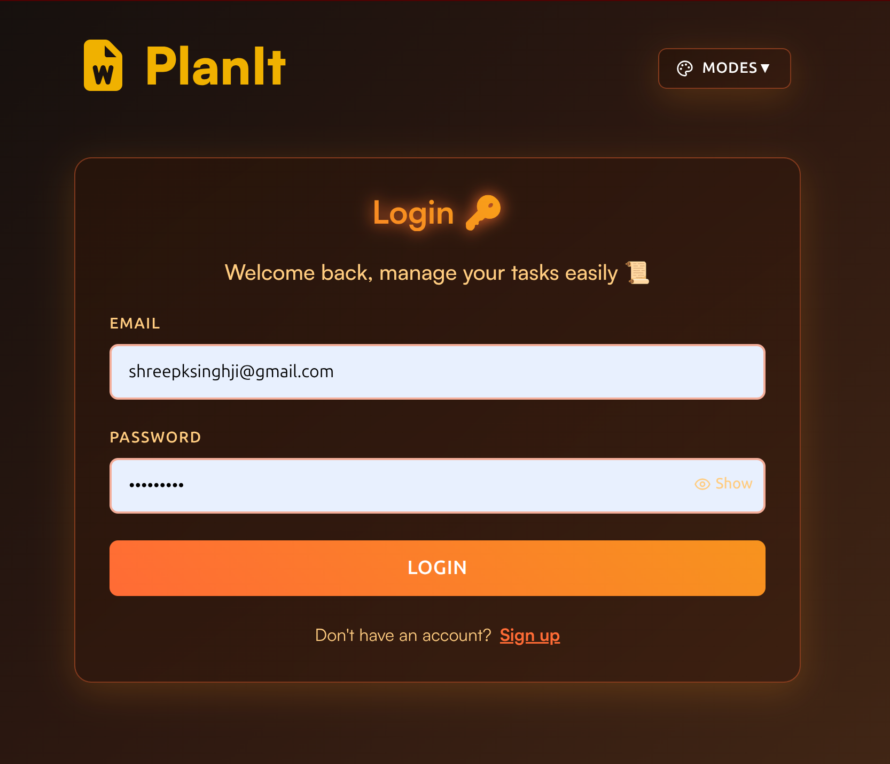
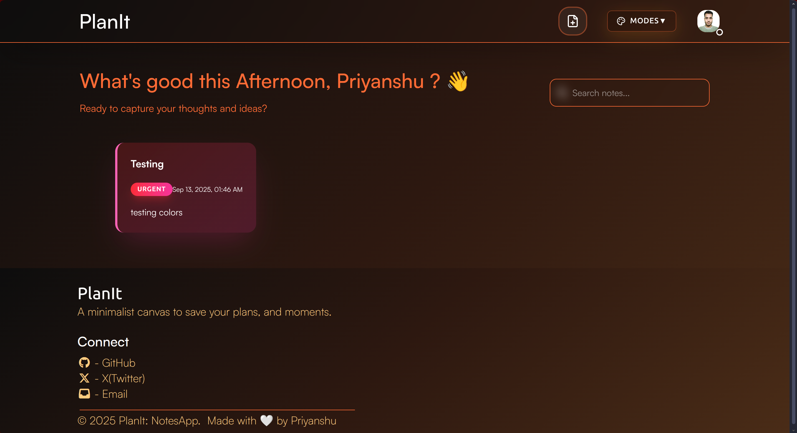
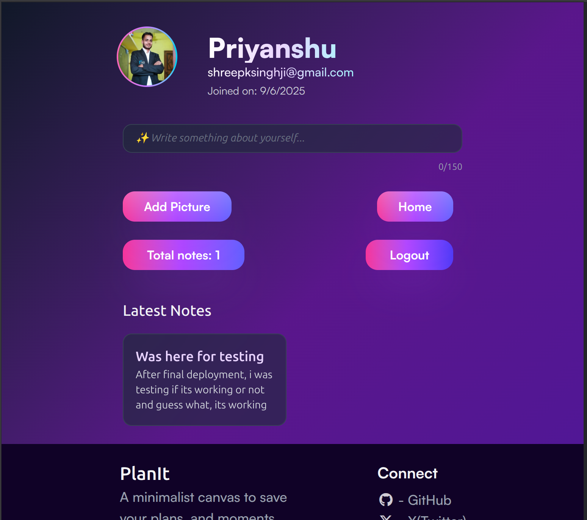
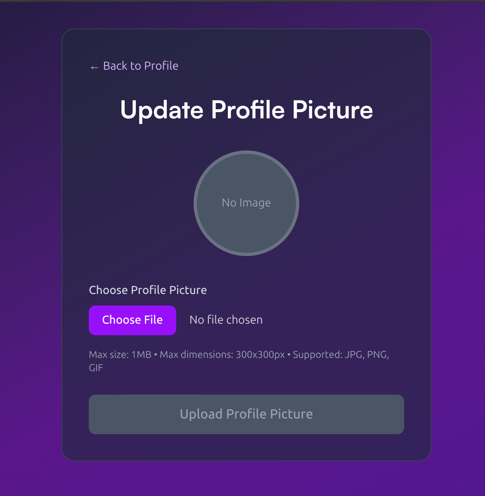

# 🗒 PlanIt: MERN Notes app

[](https://expressjs.com/)

[](https://nodejs.org/)

### A full-stack app built with MongoDB, Express, React, Node.js.  
Features secure authentication, image uploads, reponsive UI, and a polished user experience.  
Built with ❤️,  debugged at 2AM, and deployed end-to-end.  

<br> 
<br>

## 🚀 Features  
**✅️ User authentication (Signup/Login with JWT + OAuth)**  
**✅️ Password hashing for secure storage**  
**✅️ Profile picture upload (cloudinary + Multer)**  
**✅️ Create, edit, delete notes**  
**✅️ Category labels with custom colors**  
**✅️ Responsive design for all devices**  
**✅️ Global context for smoother state management**  
**✅️ Toast notification (Lucide + React Hot Toast)**  
**✅️ Deployed frontend on Vercel**  
**✅️ Deployed backend on Railway**  
**✅️ Database hosted on MongoDB Atlas**

<br>
<br>

## 🖼️ Screenshots  
  

<br>
<br>

## 🛠️ Teach Stack  
**・ Frontend:** React, TailwindCSS, Context API  
**・ Backend:** NodeJS, ExpressJS, JWT, bcrypt  
**・ Database:** MongoDB Atlas  
**・ File Handling:** Multer, Cloudinary  
**・ Deployment:** Vercel (Frontend), Railway (Backend)

<br>
<br>

## ⚡ Installation and setup  
```
#clone frontend
https://github.com/yansh07/todo-frontend
cd todo-frontend
npm install
npm start

#clone backend
https://github.com/yansh07/todo-backend
cd todo-backend
npm install
npm start  
```

### Add you environment variables (.env)  
MONGO_URI=your_mongo_atlas_url
JWT_SECRET=your_secret  
CLOUDINARY_NAME=XXXX  
CLOUDINARY_API_KEY=XXXX  
CLOUDINARY_API_SECRET=XXXXX  

<br>
<br>

## ⭐ Future Improvements  
**・ Search and filter notes**  
**・ Dark mode**  
**・ Rich text editor (bold/italic/underline)**  
**・ Drag & Drop reodering**  
**・ Share notes with other users**  

<br>
<br>

## 🏆 Lesson learned  
・ Debugging deployment issues at 2AM  
・ JWT + bcrypt = production ready auth system  
・ Cloudinary integration for image uploads  
・ Using context for global state (Reduced prop drilling headaches)  
・ Full-Stack deployment pipeline mastery (Railway + vercel + atlas)  

<br>
<br>

## 🤝🏻 Contribution  
Pull requests are welcome! For major changes, open an issue first to discuss what you'd like to change.  

<br>
<br>

## 👨🏻‍💻 Author  
**Priyanshu Kumar Singh**  
<br>

[](https://x.com/yansh_08)
 [](mailto:pksingh69313@gmail.com)
 [](https://priyanshu8.vercel.app/)
